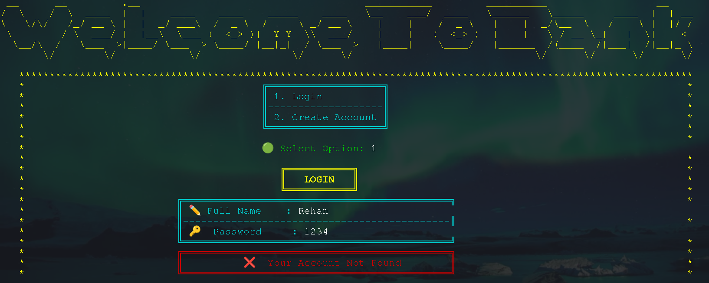
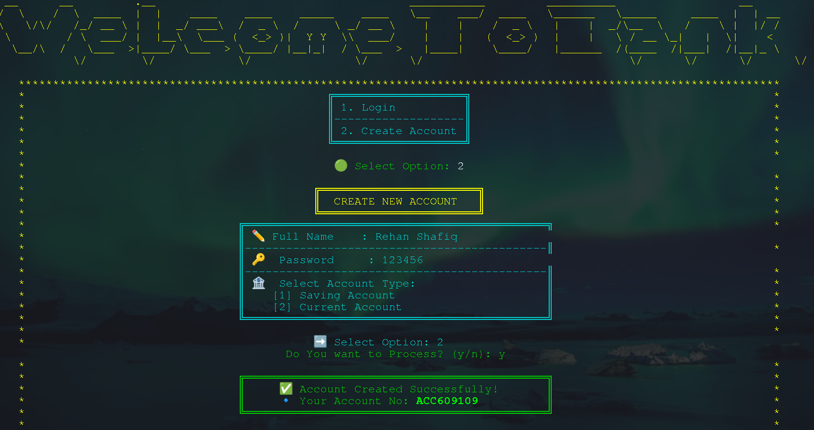
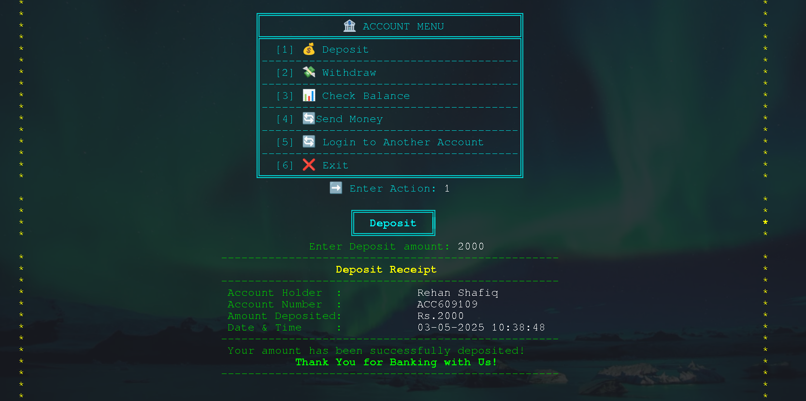
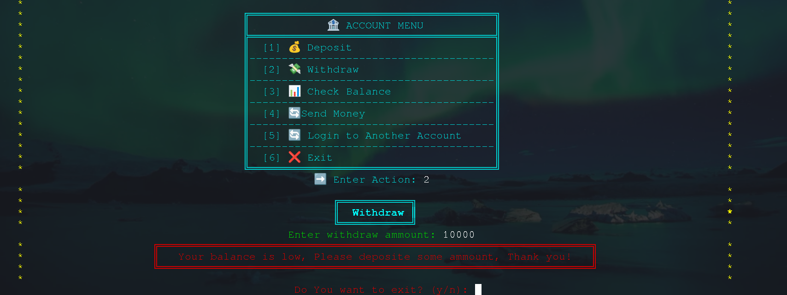
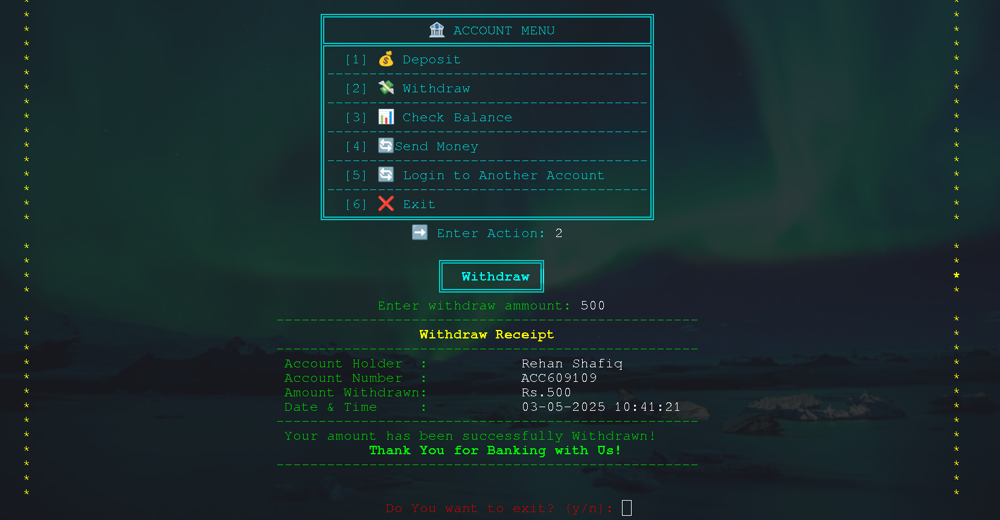
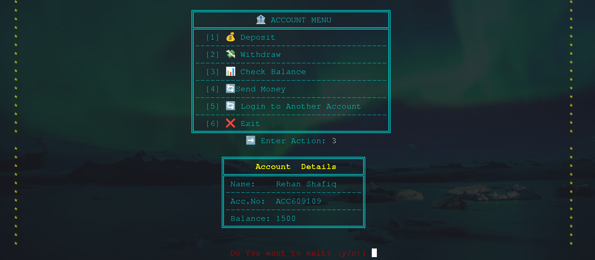
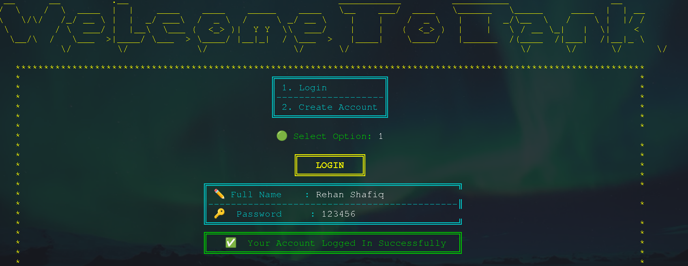

# Banking System Project

## Overview
This Banking System is a Java-based console application that simulates basic banking operations. It allows users to create accounts, log in, perform transactions such as deposits and withdrawals, and generate transaction receipts. The system uses ArrayLists for in-memory data storage, making it a lightweight project without a database dependency. This project is ideal for learning fundamental programming concepts like object-oriented programming, data structures, and user input handling.

## Features
- **User Authentication**:
  - Login for existing users with account credentials.
  - Option to create a new account with basic user details.
- **Account Management**:
  - Create multiple accounts for a single user.
  - Store account details using ArrayLists.
- **Transactions**:
  - Deposit funds into an account.
  - Withdraw funds from an account (with balance validation).
  - Generate receipts for deposit and withdrawal transactions.
- **Console-Based Interface**:
  - Simple and intuitive menu-driven interface for user interaction.

## Technologies Used
- **Programming Language**: Java
- **Data Structure**: ArrayList (for in-memory storage of user and account data)
- **Environment**: Console-based application

## Installation
1. **Clone the Repository**:
   ```bash
   git clone https://github.com/Rehancodecraft/Banking-System.git
   ```
2. **Navigate to the Project Directory**:
   ```bash
   cd Banking-System
   ```
3. **Compile the Java Files**:
   ```bash
   javac Bank/Main.java
   ```
4. **Run the Application**:
   ```bash
   java Bank/Main
   ```

## Usage
1. **Launching the Application**:
   Upon launching the application, the user is presented with two options:
    - **Login**: Enter credentials (full name and password) to access an existing account. If the account does not exist, an error message is displayed.
    - **Create Account**: Proceed to create a new account by providing required details.

       

2. **Creating a New Account**:
   After selecting the "Create Account" option, the user is prompted to:
    - **Enter Full Name**: Provide their full name for the account.
    - **Enter Password**: Set a password for account security.
    - **Select Account Type**: Choose between a savings account or a current account.
    - **Account Created Successfully**: Upon successful creation, a confirmation message is displayed with the generated account number.

       

3. **Banking Services**:
   After account creation or login, the user can access the following services:
    - **Deposit Funds**:
      Select option 1 to deposit money. Enter the amount, and a deposit receipt is generated.

      
    - **Withdraw Funds**:
      Select option 2 to withdraw money. If the withdrawal amount exceeds the deposited balance or no funds have been deposited, an error is displayed. Otherwise, the amount is withdrawn, and a receipt is generated.

      

      
    - **Check Balance**:
      Select option 3 to view account details, including the remaining balance and other account information.

      
    - **Create New Account**:
      Select option 4 to create an additional account under the same user, following the same account creation process.
    - **Login to Another Account**:
      Select option 5, enter the full name and password of another account, and log in successfully if credentials are valid.

      
4. **Exit the Application**:
   Select option 6 to exit the banking system.
      
      

## Project Structure

- `Main.java`: Entry point of the application, contains the main menu and user interaction logic.
- `BankAccount.java`: Class to manage account details and transactions.

## Limitations
- Data is stored in-memory using ArrayLists, so all data is lost when the application closes.
- No persistent database integration.
- Basic console interface without graphical user interface (GUI).
- Limited error handling for invalid inputs.

## Future Improvements
- Integrate a database (e.g., MySQL or SQLite) for persistent storage.
- Add a graphical user interface using JavaFX or Swing.
- Implement advanced features like:
  - Transaction history with timestamps.
  - Loan management.
  - Interest calculation.
- Enhance security with password encryption.

## Contributing
Contributions are welcome! To contribute:
1. Fork the repository.
2. Create a new branch (`git checkout -b feature-branch`).
3. Make your changes and commit (`git commit -m "Add feature"`).
4. Push to the branch (`git push origin feature-branch`).
5. Open a pull request.

## License
This project is licensed under the MIT License. See the [LICENSE](LICENSE) file for details.

## Author
- Rehan Shafiq
- GitHub: [Rehancodecraft](https://github.com/Rehancodecraft)